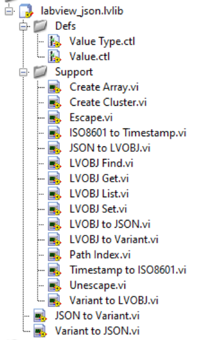

# labview_json
Lightweight JSON encoder and decoder for LabVIEW.

**No external dependencies, only 20 LV files, 580kB size**

Functions:

* JSON to Variant.vi - Load JSON to LV Variant
* Variant to JSON.vi - Dump LV Variant to JSON

**Supported Data Types:**

* Null (Empty Variant)
* Booleans
* Integers (I8, I16, I32, I64, U8, U16, U32, U64, U8ENUM, U16ENUM, U32ENUM)
* Floats (SGL, DBL, EXT)
* Strings (STR, PTH, TIMESTAMP, U8ENUM, U16ENUM, U32ENUM)
* Objects (Clusters, Waveforms, LV Variant)
* Arrays (1D)

## Features

* Recursively creates nested objects in a {key:STR, type:U8ENUM, value:VARIANT} type def.
* Pretty print indentation for JSON output.
* Enums can be exported as integers or strings.
* Float extensions supported: `Infinity`, `-Infinity`, `NaN`
* Timestamps are ISO8601 offset date time strings `yyyy-mm-ddThh:mm:ss.uuuuuu+zz:zz`.
* Waveforms are objects with {y0:TIMESTAMP, dt:DBL, Y:[DBL]}.
* The `JSON Path` parameter fetches nested elements by object keys or array indexes without needing to define the data structures.
* Use the `Value.ctl` cluster to return complex structures recursively.
* Low level element control to list, get, set or pop nested elements.
* Unicode is left unescaped `\uXXXX` or `\uXXXXXXXX` (LabVIEW natively supports UTF-8)

## Unit Tests
Extensive unit testing.

Run the `tests\test.vi`

## YAJL (Yet Another JSON Library?!?):
Yes, I understand there are a plethora of JSON libraries for LabVIEW.
Why this one, you ask? Because many libraries available are overly
complicated with unnecessary class abstraction and external
dependencies. The focus for this library is KISS (Keep It Stupid Simple).
No fuss, no mess, just easy to read code.

Feedback is welcome.