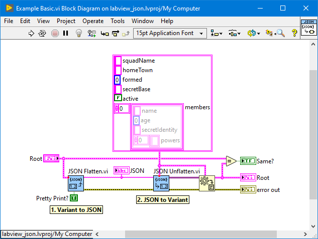

# labview_json
Lightweight JSON library for LabVIEW.

**No external dependencies, only 32 files, 659kB size**

## Features

* Full modification support to list, get, set, and pop elements
* Recursively create nested objects in a `{key:STR, type:U8ENUM, value:VARIANT}` type def.
* Pretty print indentation for JSON outputs.
* Enums can be exported as integers or strings.
* Float extensions support `Infinity`, `-Infinity`, `NaN`
* Timestamp support as ISO8601 offset date time strings `yyyy-mm-ddThh:mm:ss.uuuuuu+zz:zz`.
* Waveforms are objects with `{y0:TIMESTAMP, dt:DBL, Y:[DBL]}`.
* The `Root Path` parameter fetches nested elements by object keys or array indexes without needing to define the data structures.
* Use the `Element.ctl` cluster to return complex structures recursively.
* Unicode is left unescaped `\uXXXX` (LabVIEW UTF-8 limitation)
* __NO EXTERNAL DEPENDENCIES!!!__

## Supported Data Types

* Null (Empty Variant)
* Booleans
* Integers (I8, I16, I32, I64, U8, U16, U32, U64, U8ENUM, U16ENUM, U32ENUM)
* Floats (SGL, DBL, EXT)
* Strings (STR, PTH, TIMESTAMP, U8ENUM, U16ENUM, U32ENUM)
* Objects (CLUSTERS, WAVEFORMS, VARIANTS)
* Arrays (1D)

## API

* `JSON to Variant.vi` - Imports JSON string to a LabVIEW Variant
* `Variant to JSON.vi` - Exports LabVIEW Variant to JSON string
* `JSON List.vi` - Lists the nested object keys or array indexes for easy navigation
* `JSON Get.vi` - Gets an element
* `JSON Set.vi` - Sets an element
* `JSON Pop.vi` - Removes and returns an element

## Examples

See the example VIs in the [json/examples](json/examples) directory.

## Unit Tests
Extensive unit testing

See the [json/tests](json/tests) directory.

To test, run `labview_json_tests.lvlib:test.vi`.

## YAJL (Yet Another JSON Library)
Yes, I understand there are a plethora of JSON libraries for LabVIEW
(Even built in ones).
Why this library, you ask? 
- Because LabVIEW's built in JSON libraries lack common operations other 
languages natively support (i.e. get, set, pop, list elements). 
- Because many libraries available are overly complicated with unnecessary class
abstraction and external dependencies. :(
- Because many libraries try to use magic data types to identify primitives
(i.e. Null) that only flummox basic usage.
- Because other libraries add maleware that require you to install crap all
over the place.

This a self contained JSON library for anyone that wants it. Period.

Keep your feedback to yourself... nah, just kidding. Feedback is welcome.
